# HYPERCRAFT

A 4D voxel survival sandbox for the browser. The world is made of tesseracts; you see a true
3D cross-section of it, and every system is built around a fourth spatial axis.

**Status: Phase 6 (the Ember Depths, 4D portals, the Magma Regent) complete.** Phase reports
(what works, what's broken, what's next): [Phase 1 — engine](docs/phases/phase-1.md) ·
[Phase 2 — surface terrain](docs/phases/phase-2.md) · [Phase 3 — items](docs/phases/phase-3.md) ·
[Phase 4 — mobs](docs/phases/phase-4.md) · [Phase 5 — structures](docs/phases/phase-5.md) ·
[Phase 6 — Ember Depths](docs/phases/phase-6.md).

| Axis-aligned slice | 30° XW tilt | 45° XW + 45° ZW tilt |
|---|---|---|
| 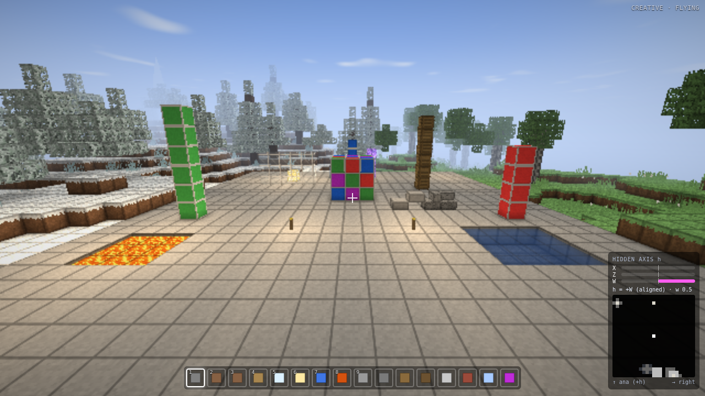 | 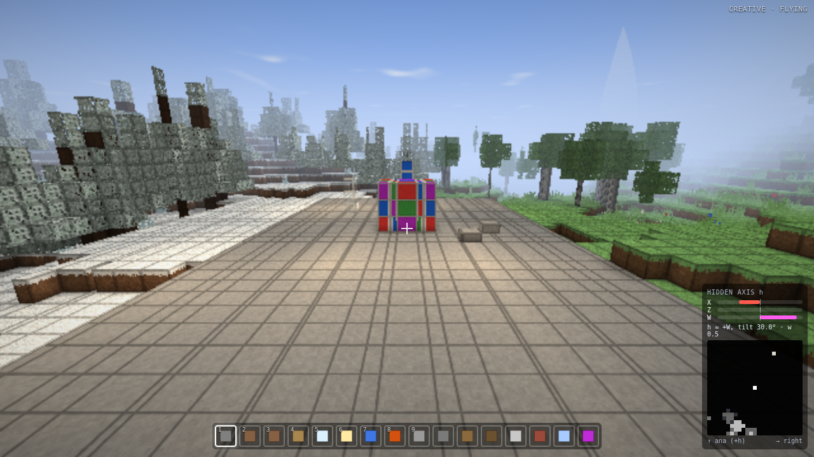 | 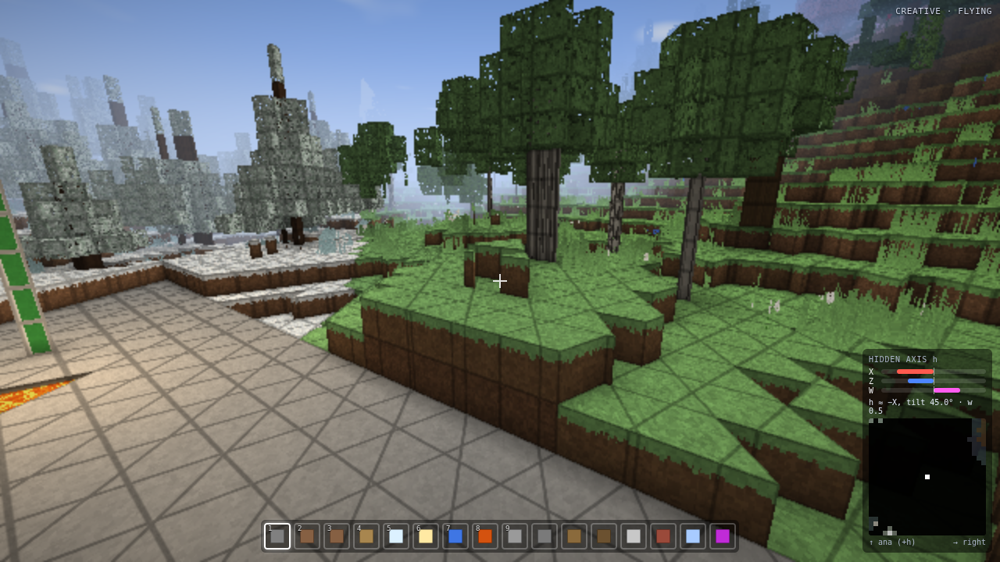 |
| cubes | stretched/split boxes | triangular & hexagonal prisms |
| 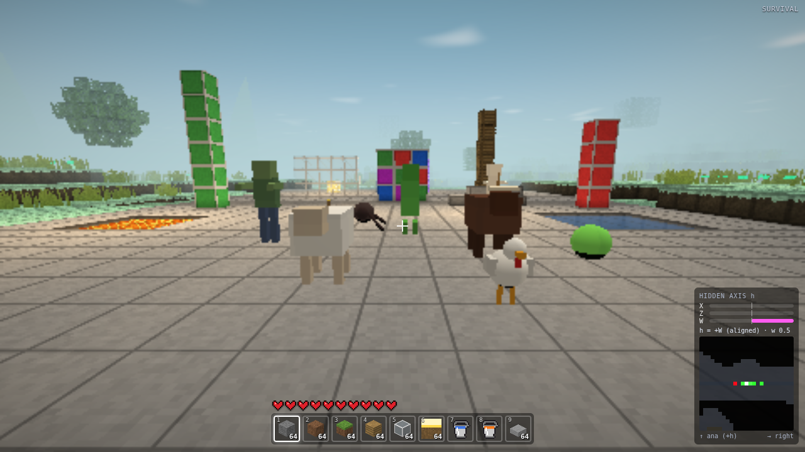 | 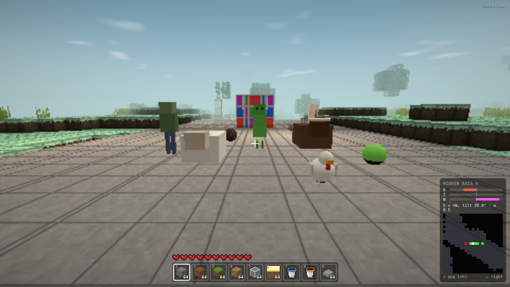 | 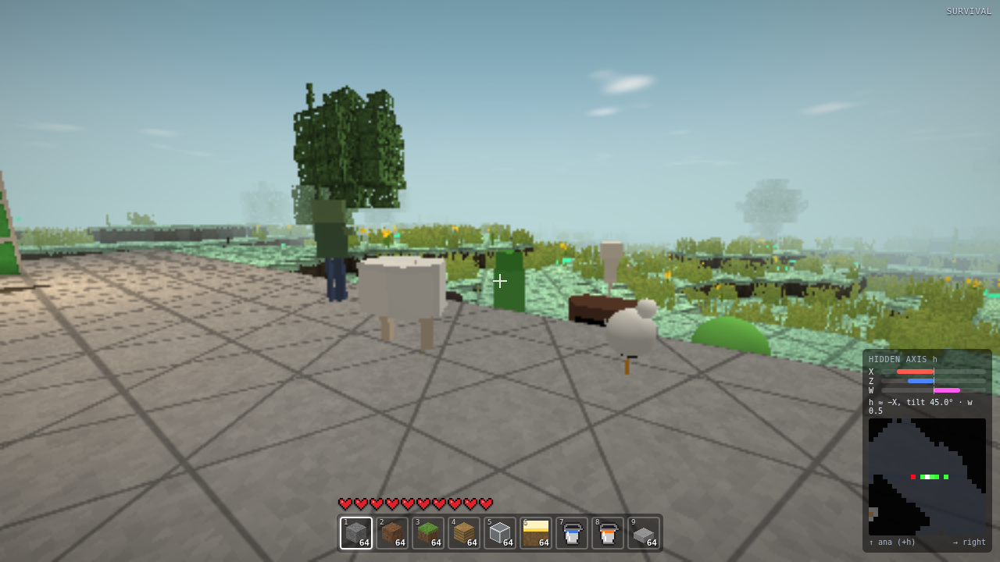 |
| mobs: their own 3D sections | oblique cuts: bodies stretch, legs slip out of the slice | other legs cross it (sheep: two, chicken: one) |
| 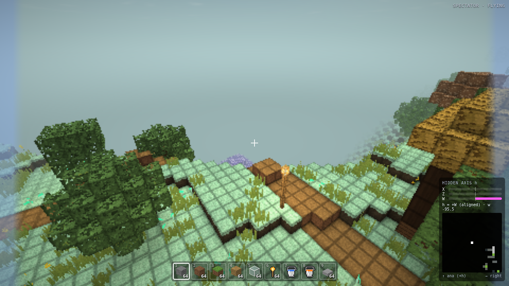 | 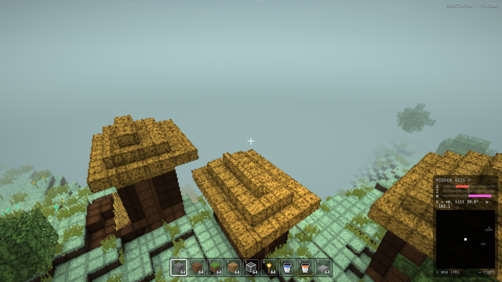 | 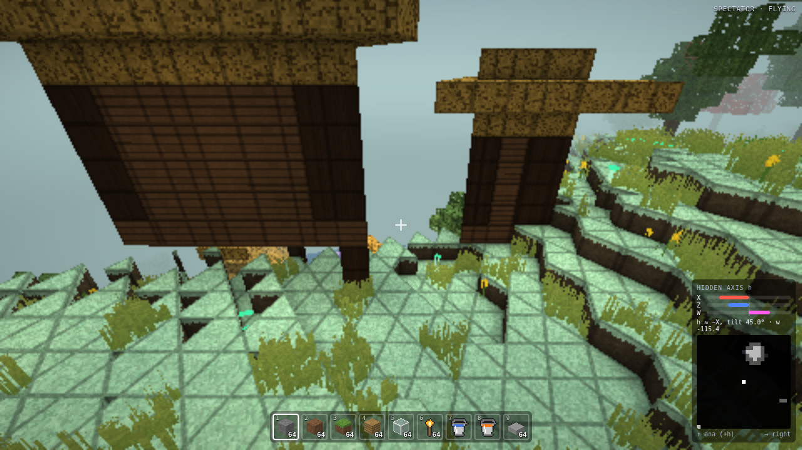 |
| a village road, lamp post and houses | the same village, tilted through W | oblique cuts through 4D houses on stilts |
| 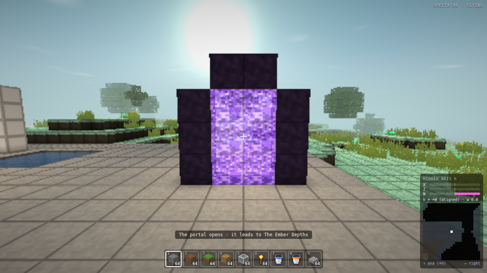 | 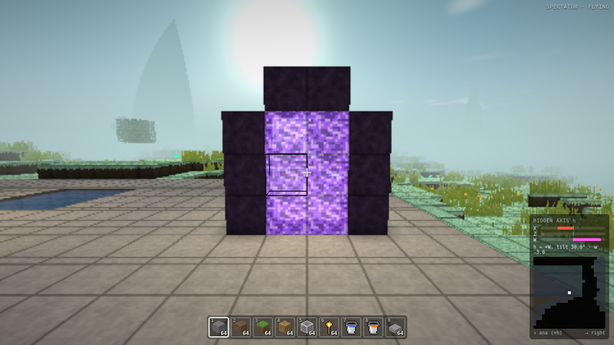 | 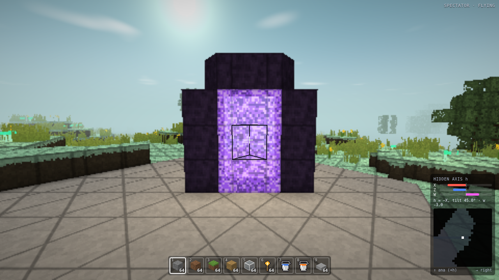 |
| a lit 4D portal (a 3D hyper-frame, normal along x) | tilted: the frame is cut obliquely | the membrane's 3D box cut by a doubly tilted slice |

## Run it

```bash
npm install
npm run dev            # http://localhost:5173
```

Requires a browser with WebGL2. Useful URL parameters: `?rd=4` (render distance in chunks,
2–8), `?res=360` (fixed internal height, or `auto`), `?fov=75`, `?bench=1` (benchmark),
`?test=1&seed=text` (ephemeral test world with the engine test garden, no menus and no
particles unless `&particles=1`; used by tests).

## Controls

| Input | Action |
|---|---|
| Mouse or **arrow keys** | look |
| **W A S D** | move in the slice |
| **Q / E** | move **kata / ana** along the current hidden axis |
| Space (double-tap in creative) | jump (toggle flying) |
| Shift / Ctrl (or R) | sneak / sprint |
| **Z / X** | rotate the slice: right ↔ hidden |
| **F / V** | rotate the slice: forward ↔ hidden |
| **Alt + mouse** | rotate the slice freely |
| **C** | snap back to the nearest axis-aligned slice |
| LMB (hold in survival) / RMB / MMB | attack or mine / place, use, open stations, draw a bow (hold) / pick block |
| **Tab** or **I** | inventory, crafting and recipe book |
| **B** (Ctrl+B) | drop the held item (the whole stack) |
| 1–9, wheel | hotbar |
| F3 (or `) | debug overlay |
| **P** | cross-section wireframe overlay |
| G / T / Y / O | game mode / time +3 h / weather / internal resolution (cheats/creative) |

**Touch screens** (auto-detected, or Settings → Touch controls):
* **Move.** Left thumb works a floating move stick (a faint ring shows where); push it to the
  rim to sprint.
* **Look and interact.** On the right side, drag to look. Tap a mob to hit it, or tap a block
  to use or place on it, right where you tapped. Long-press mines the block under your
  finger; slide the finger to move on to the next block.
* **Slice.** Two-finger twist rotates the slice right↔hidden; two-finger drag rotates it
  forward↔hidden.
* **Buttons.**
  * ⛏/⚔ Hit and ✋ Use act at the crosshair (hold Use to draw a bow).
  * Jump, Sneak, Kata/Ana and Drop.
  * Slice rotation and snap.
  * 🎒 Inventory, pause, fly (creative), F3 and P.
* **Hotbar and screens.** Tap the hotbar to switch items. Every screen has a ✕ close button
  and scales to fit a phone. On phones the recipe book is a toggle. In screens, **Quick
  move** makes taps move whole stacks, and holding a slot splits it.

**Worlds and seeds**: Singleplayer → Create new world. Type any seed (numbers are used
as-is, text is hashed), roll a random one with 🎲, or pick a seed idea. Worlds autosave to the
browser (IndexedDB) every 30 s and on pause/quit, and can be exported/imported as `.hcworld`
files from the world list.

The **hidden-axis panel** (bottom right) shows the hidden axis `h` as X/Z/W bars, and a radar of
the plane spanned by *right* (→) and *ana* (↑) around you: walls, water, lava and drop-offs you
can't see in the slice, plus mobs as dots (red hostile, green passive). Lava along ±h makes the
matching screen edge glow orange (left = kata, right = ana); a hostile mob hidden kata/ana of you
makes it pulse violet and is named at the top of the screen.

**Survival**: 10 hearts (natural regeneration), air underwater, fall/lava/cactus/drowning/void
damage, death drops your inventory and shows a respawn screen (hardcore: spectator). Mobs spawn
from each biome's tables all around you in 4D, not only in your slice.

**Fire** spreads like Minecraft's, in 4D: through wood, leaves, wool and plants along all
eight face directions, burning them away. Touch it (or lava) and you burn until it runs out
or you reach water; mobs burn too. It burns forever on cinder and magma.

**The Ember Depths**: build an obsidian portal frame like Minecraft's (4 × 5, corners
optional) and light it with flint and steel, or go full 4D and frame a 3D box of air on every
face (a hyper-portal; 10 blocks at minimum around a 1 × 2 × 1 interior). Stand in it for 4 s. One block in the Ember Depths is 8 on the Surface, along x, z **and** w.
Down there are eight biomes, citadels you climb by walking through W, and the Magma Regent
in its caldera on the lava sea. Its lava pillars erupt along W, so sidestep in your slice.

**Beds**: craft one from 3 wool over 3 planks, or use one in a village house. Right click it at
night (or in a thunderstorm) to sleep until morning. Any bed you use becomes your respawn
point, by day too. Monsters within 8 blocks stop you from sleeping; the message says which one
and where, even if it is kata or ana of your slice.

**Structures and villages**: 32 structures generate on a 4D grid: villages in seven styles,
temples, dungeons, hypermines, vaults, shipwrecks, ruins and more. Villages are crosses of
streets along ±X, ±Z and ±W, so walk kata/ana to see the rest. Right click a villager to trade
(the currency is Verdant). Trading levels villagers up and unlocks better offers. Atlases point
to the nearest village, temple, vault or ruin.

## Develop

```bash
npm test               # unit tests (vitest)
npm run typecheck
npm run ci             # typecheck + unit + the Playwright e2e specs (smoke, R6 views, worlds, items, mobs, touch, structures)
BENCH=1 npx playwright test bench   # engine benchmarks (writes test-results/bench/)
node scripts/alloc-profile.mjs      # sample per-frame allocations (needs `npm run dev`)
```

## Docs

- [Architecture](docs/architecture.md)
- [GPU layout](docs/gpu-layout.md)
- [Rendering a 4D world through a 3D slice](docs/rendering-4d.md)
- [Data formats](docs/data-formats.md)
- How to add a [block](docs/how-to/add-a-block.md), [item / recipe / tool tier](docs/how-to/add-an-item.md), [biome](docs/how-to/add-a-biome.md),
  [realm](docs/how-to/add-a-realm.md), [mob](docs/how-to/add-a-mob.md),
  [structure](docs/how-to/add-a-structure.md)
- Benchmarks: [Phase 1](docs/benchmarks/phase-1.md), [Phase 2](docs/benchmarks/phase-2.md) ·
  [Changelog](CHANGELOG.md) · [Known issues](KNOWN_ISSUES.md)
